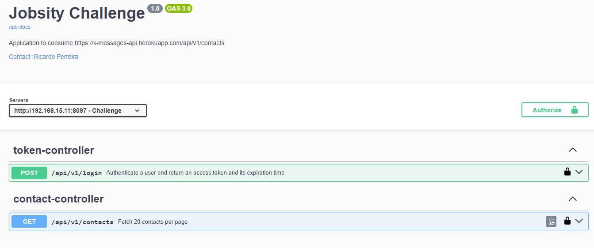

## _API Aggregator Challenge_ <br />
Goal: Develop an API to consume a contacts endpoint 

## _Table of contents_

- [_Overview_](#overview)
- [_Requirements_](#requirements)
- [_Project Structure_](#requirements)
- [_Howto Build and Run_](#requirements)
- [_Screenshot_](#screenshot)
- [_Links_](...)
- [_Built with_](#built-with)
- [_Code Snippet_](#requirements)
- [_Continued development_](#continued-development)
- [_Useful resources_](#useful-resources)
- [_Author_](#requirements)
- [_Portfolio_](#requirements)

## _Overview_

This challenge delivers an API to consume contacts endpoint. 
The goal is to evaluate how a dev face the challenge of
building a REST API, according to a spec provided and detailed below.


## _Requirements_

- The response from the endpoint should match the schema provided in the requirements.
<br />
- Project structure and organization of your code: we want to see if your code follows good patterns, and separates
concerns between controllers, services, and repositories.
<br />
- Capacity to follow good principles like Clean Code and SOLID.
<br />
- Capacity to use design patterns and knowledge about the chosen one(s) usage.
<br />
- Ability to consume other APIs and correctly handle pagination.
<br />
- Knowledge about the tools you decided to use.
<br />
- Ability to create smart tests to enhance your code quality.

Based on these, the app consumes services of another api -> <a href="https://k-messages-api.herokuapp.com" target="_blank">Contacts API</a>.

<br />
You can play with the app, visiting the link below after you build the app
according to the instructions.

http://127.0.0.1:8097/swagger-ui/html
<br />
The app has been coded using Java 17, Spring Boot 3.3.4, Gradle, Javadoc, Spring Security, Spring JPA, 
Spring Webflux, OpenAPI, JUnit, Mockito, MySQL, Docker and others.<br />
Take a look at the video below to understand how I faced the challenge.
<br />
<a href="https://youtu.be/CUdN-P-14So" target="_blank">Short Video</a>
<hr />

## _Project Structure_
- docs
   - javadocs
- src
    - main
    - java
        - br.dev.ferreiras.challenge
            - contracts
            - config
            - controller
              - handlers 
            - dto
            - entity
            - enums
            - repository
            - services
              - exceptions
    - resources
        - certs
    - test
      - java
        - br.dev.ferreiras.challenge
          - controller
          - service
-

## _Howto Build and Run_

  ```
  - MySQL Database: http://127.0.0.1:3306:challenge
  - credentials available at classpath:db.properties
  - profile active: dev or prod
  - production socket:127.0.0.1:8097
  - tweak a few knobs to get it up and running according to the instructions
    provided at classpath:dockerBuild.sh or just in case you want ro run
    locally go to {PWD}/challenge and run ./gradlew run, or check the video
    url shown below.

```

## _Screenshot_

[]()

## _Links_

- Live Site URL: <a href="https://challenge.ferreiras.dev.br/swagger-ui/index.html" target="_blank">API Aggregator</a>

## _Built with_

[](https://skillicons.dev)

## _Code Snippet_

```java
import java.util.List;

/**
 * 
 * @author ricardo@ferreiras.dev.br
 * @version 1.1.10.23.01
 * @since 1.0
 *
 */

@RestController
@RequestMapping("api/v1")
public class ContactController {

    private final ContactService contactService;

    public ContactController(ContactService contactService) {
        this.contactService = contactService;
    }

    @Operation(summary = "Fetch 20 contacts per page")
    @ApiResponses(value = {
            @ApiResponse(responseCode = "200", description = "Get up to 20 contacts per page.",
                    content = {@Content(mediaType = "application/json",
                            schema = @Schema (implementation = ResponseContactsDto.class))}),
            @ApiResponse(responseCode = "400", description = "Bad Request",
                    content = {@Content(mediaType = "application/json")}),
            @ApiResponse(responseCode = "401", description = "Access Denied",
                    content = {@Content(mediaType = "application/json")}),
            @ApiResponse(responseCode = "403", description = "FORBIDDEN",
                    content = {@Content(mediaType = "application/json")}),
            @ApiResponse(responseCode = "404", description = "Resource not found!",
                    content = {@Content(mediaType = "application/json")})
    })
    @ResponseStatus(HttpStatus.OK)
    @GetMapping("/contacts")
    @PreAuthorize("hasAuthority('SCOPE_ROLE_ADMIN')")
    public Mono<ResponseContactsDto> getContacts(
            @RequestParam(defaultValue = "1") int page,
            @RequestParam(defaultValue = "20") int size
    ) {

        return contactService.makeApiRequest()
                .bodyToMono(ResponseContactsDto.class);

    }
}


``` 

## _Continued development_

- Unit Tests 
- Subscriber Authentication - OK
- Spring JWT-OAuth2 - OK
- Records Pagination - TBD

### _Useful resources_

- [https://spring.io/] Awesome Java framework!.
- [https://start.spring.io/]  Handy startup tool.
- [https://mvnrepository.com/]

## _Author_
<a href="mailto:ricardo@ferreiras.dev.br">Ricardo Ferreira</a>

## - _Portfolio_
<a href="https://www.ferreiras.dev.br" target="_blank">My Portfolio...</a>

